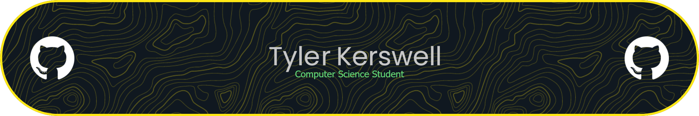

<h2>About me</h2>

- Currently a third-year computer science student at the University of British Columbia

- I'm available for winter co-ops starting in January
  
- Currently learning: key exchange, encryption, python sockets
  
- Currently working on: python encrypted chat application

- E-mail: [TylerKerswell@gmail.com](mailto:TylerKerswell@gmail.com)  

- Resume: [here](./resume1.pdf)

<h2>Skillset</h2>

  
  <h3>Languages:</h3>
  
  
  
  
  
  
  
  

<h2>Links</h2>

<table>
    <tbody>
        <tr>
            <td></td>
            <td></td>
        </tr>
    </tbody>
</table>
  

<h2>Stats</h2>

  

   

  

<h2>Check out my projects:</h2>

<!--
**TylerKerswell/TylerKerswell** is a ✨ _special_ ✨ repository because its `README.md` (this file) appears on your GitHub profile.

Here are some ideas to get you started:

- 🔭 I’m currently working on ...
- 🌱 I’m currently learning ...
- 👯 I’m looking to collaborate on ...
- 🤔 I’m looking for help with ...
- 💬 Ask me about ...
- 📫 How to reach me: ...
- 😄 Pronouns: ...
- ⚡ Fun fact: ...
-->
